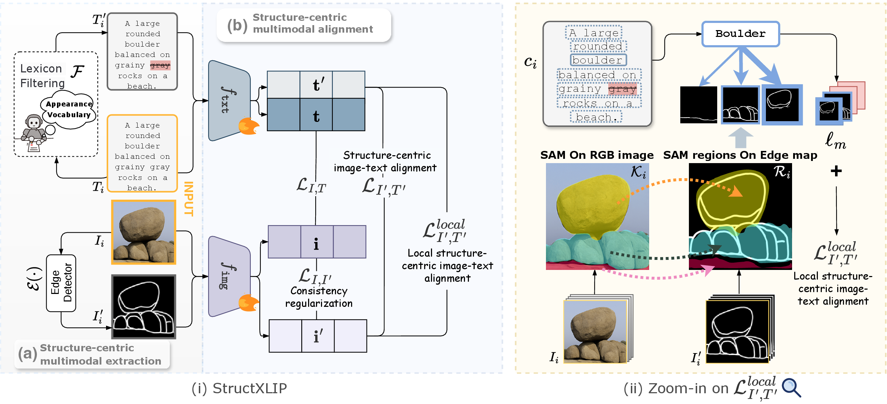

# StructXLIP: 基于多模态结构线索的视觉-语言模型增强

<p align="center">
  
</p>

<p align="center">
  <b>CVPR 2026</b> &nbsp;·&nbsp;
  <a href="README.md">English</a>
</p>

<p align="center">
  <a href="https://arxiv.org/abs/2602.20089"></a>
  <a href="https://eveleslie.github.io/structxlip-web/"></a>
  <a href="https://huggingface.co/zanxii/StructXlip"></a>
  <a href="https://huggingface.co/datasets/zanxii/StructXlip"></a>
  <a href="https://www.python.org/"></a>
  <a href="https://pytorch.org/"></a>
</p>

---

<p align="center">
  <span style="font-size: 18px">发音：<b>/strʌk slɪp/</b> &nbsp;·&nbsp</span>
</p>

---


StructXLIP 在 CLIP-based 的对比学习中引入**结构线索**（例如边缘图），与 RGB 图像协同训练。

三项新的训练目标实现于 [`structxlip/losses.py`](structxlip/losses.py)，并以独立 PyTorch 模块形式封装在 [`plug_and_play_loss.py`](plug_and_play_loss.py)：

| 训练目标 | 函数名|
|---|---|
| 结构中心对齐 | `compute_structure_centric_loss` | 对比对齐：全局结构嵌入 ↔ caption 嵌入 |
| RGB–结构一致性 | `compute_rgb_structure_consistency_loss` | 余弦一致性：RGB 特征 ↔ 结构特征 |
| 局部结构中心对齐 | `compute_local_structure_centric_loss` | 多正例 InfoNCE：文本 chunk ↔ top-K 局部结构段 |

---

## 仓库结构

```
StructXLIP/
├── plug_and_play_loss.py        # ⭐ 独立 loss 模块，即插即用
├── structxlip/
│   ├── train.py                 # python -m structxlip.train
│   ├── retrieval.py             # python -m structxlip.retrieval
│   ├── dataloader.py            # JSON → tensors（RGB + 结构图）
│   ├── losses.py                # 完整 loss 实现
│   ├── text_filters.py          # Caption 过滤工具
│   └── utils/func.py            # 长 token 位置编码扩展等工具
├── scripts/
│   ├── finetune.sh
│   ├── eval.sh
│   └── package_sketchy_to_hf.py
├── datasets/                    # 示例 JSON 列表
├── weights/                     # 本地权重
└── requirements.txt
```

---


## 快速开始 — Sketchy 检索评测

**第一步**：安装环境

```bash
conda create -n structxlip python=3.10 && conda activate structxlip
pip install -r requirements.txt
```

**第二步**：下载权重与测试数据

```bash
hf download zanxii/StructXlip Sketchy.pth --repo-type model --local-dir weights
hf download zanxii/StructXlip sketchy_test.zip --repo-type dataset --local-dir data/structxlip
```

**第三步**：解压并生成本地路径 JSON

```bash
mkdir -p data/structxlip/sketchy_test_images
unzip -q data/structxlip/sketchy_test.zip -d data/structxlip/sketchy_test_images

python - <<'PY'
import json
from pathlib import Path
src  = Path("datasets/test/Sketchy.json")
out  = Path("datasets/test/Sketchy_local.json")
imgs = Path("data/structxlip/sketchy_test_images").resolve()
data = json.loads(src.read_text())
for r in data:
    r["original_filename"] = str(imgs / r["file_name"])
out.write_text(json.dumps(data, ensure_ascii=False, indent=2))
print(f"已生成: {out}  ({len(data)} 条)")
PY
```

**第四步**：运行评测

```bash
python -m structxlip.retrieval \
  --dataset datasets/test/Sketchy_local.json \
  --ckpt    weights/Sketchy.pth \
  --model   B \
  --eval_batch_size 32
```

---
## 训练

```bash
python -m structxlip.train \
  --dataset    /path/to/train.json \
  --model      openai/clip-vit-base-patch16 \
  --output_dir outputs/ckpt \
  --epochs     10 \
  --batch_size 16
```

或使用启动脚本：

```bash
DATASET_JSON=/path/to/train.json \
OUTPUT_DIR=outputs/ckpt \
WANDB_PROJECT=StructXLIP \
bash scripts/finetune.sh
```

<details>
<summary><b>关键训练参数</b></summary>

| 参数 | 说明 |
|---|---|
| `--lambda_global` | 标准 CLIP 全局图文损失权重 |
| `--lambda_structure_centric` | 结构中心对齐损失权重 |
| `--lambda_rgb_scribble_consistency` | RGB–结构一致性损失权重 |
| `--lambda_local_structure_centric` | 局部结构中心对齐损失权重 |
| `--chunk_top_k / --chunk_tau / --chunk_base_window / --chunk_stride` | 局部对齐参数 |
| `--remove_colors / --remove_materials / --remove_textures / --remove_insect` | Caption 过滤开关（见 `text_filters.py`） |
| `--warmup_sketch_epochs` | 仅用结构损失预热的轮数 |
| `--new_max_token` | 扩展 CLIP 文本位置编码长度 |

</details>

<details>
<summary><b>训练 JSON 格式</b></summary>

```json
[
  {
    "original_filename": "/abs/path/rgb.jpg",
    "original_caption": "full caption",
    "original_filename_structure": "/abs/path/global_structure.png",
    "segment": [
      {
        "similarity_score": 0.87,
        "filename": "/abs/path/local_crop_rgb.jpg",
        "caption": "local region caption",
        "filename_structure_cropped": "/abs/path/local_structure.png",
        "bbox_coordinates": { "x1": 0, "y1": 0, "x2": 0, "y2": 0, "width": 0, "height": 0 }
      }
    ]
  }
]
```

若结构路径缺失，dataloader 自动回退为 dummy 输入，对应结构损失为 0（等价于 RGB-only CLIP 微调）。

</details>

## 🔌 即插即用 Loss

三项训练目标均封装为独立 PyTorch 模块，见 [`plug_and_play_loss.py`](plug_and_play_loss.py)。结构中心对齐与 RGB–结构一致性**只需 PyTorch**，无需其他 StructXLIP 代码。

> **推荐从 `StructureCentricAlignmentLoss` 开始** — 接入最简单，结构信号最直接。

```python
from plug_and_play_loss import (
    StructureCentricAlignmentLoss,   # 推荐先用这个
    RGBStructureConsistencyLoss,
    LocalStructureCentricLoss,       # 需要 model + tokenizer
    cosine_anneal_warm_decay,        # 可选：损失权重调度
)

structure_centric = StructureCentricAlignmentLoss()
rgb_consistency   = RGBStructureConsistencyLoss()
local_structure   = LocalStructureCentricLoss(chunk_base_window=3, chunk_tau=0.07)

loss = (loss_clip
        + λ1 * structure_centric(scribble_emb, text_emb, has_struct, logit_scale)
        + λ2 * rgb_consistency(image_emb, scribble_emb, has_struct)
        + λ3 * local_structure(model, text_tokens, captions, edge_emb_flat, edge_mask, tokenizer)[0])
```

用随机张量快速验证：

```bash
python plug_and_play_loss.py
```

---

---

## 权重与数据

**模型权重** — [zanxii/StructXlip](https://huggingface.co/zanxii/StructXlip)

| 权重文件 | 对应数据集 |
|---|---|
| `Sketchy.pth` | Sketchy |
| `DCI.pth` | DCI |
| `DOCCI.pth` | DOCCI |
| `Insect.pth` | Insect |

```bash
hf download zanxii/StructXlip <checkpoint>.pth --repo-type model --local-dir weights
```

**数据集** — [zanxii/StructXlip](https://huggingface.co/datasets/zanxii/StructXlip)

四个 benchmark 的测试集图片均已发布在 Hugging Face，完整文件列表见数据集页面。

```bash
hf download zanxii/StructXlip <file>.zip --repo-type dataset --local-dir data/structxlip
```

---

## 开源状态

**代码**
- [x] 训练代码（`structxlip/train.py`、`losses.py`）
- [x] 检索评测代码（`structxlip/retrieval.py`）
- [ ] 结构 edge 提取与数据预处理脚本

**权重**
- [x] 模型权重：Sketchy / DCI / DOCCI / Insect

**数据集**

| 数据集 | 训练集 | 测试集 |
|--------|:------:|:------:|
| Sketchy | ✅ | ✅ |
| DOCCI   | —  | ✅ |
| DCI     | —  | ✅ |
| Insect  | —  | — |

**即插即用 Loss**
- [x] 结构中心对齐（Structure-Centric Alignment）
- [ ] RGB–结构一致性（RGB–Structure Consistency）
- [ ] 局部结构中心对齐（Local Structure-Centric Alignment）

---

## 🎉 致谢

感谢 [CLIP](https://github.com/openai/CLIP)、[LongCLIP](https://github.com/beichenzbc/Long-CLIP) 的作者们提供的优秀开源工作，本项目在其基础上构建。

本节将随项目的持续开源进展持续补充更新。*(更多致谢内容即将添加。)*

---

## 引用

```bibtex
@inproceedings{ruan2026StruXLIP,
  title     = {StructXLIP: Enhancing Vision-Language Models
               with Multimodal Structural Cues},
  author    = {Ruan, Zanxi and Gao, Songqun and Kong, Qiuyu
               and Wang, Yiming and Cristani, Marco},
  booktitle = {Proceedings of the IEEE/CVF Conference on
               Computer Vision and Pattern Recognition (CVPR)},
  year      = {2026}
}
```


